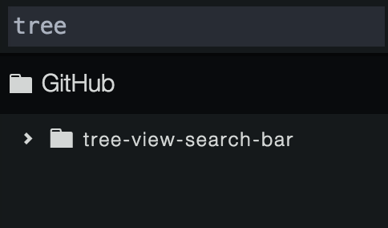
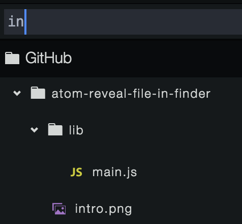
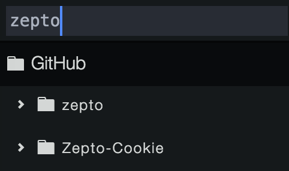
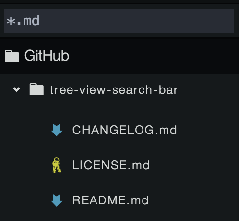
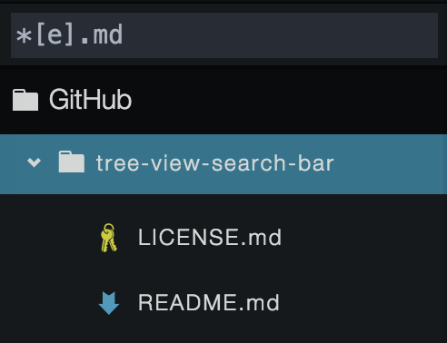
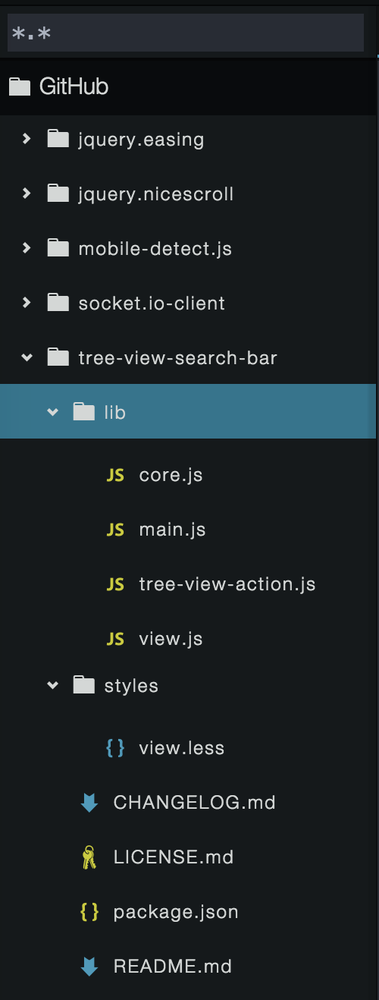
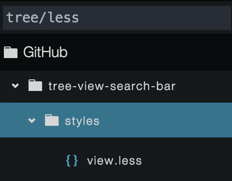
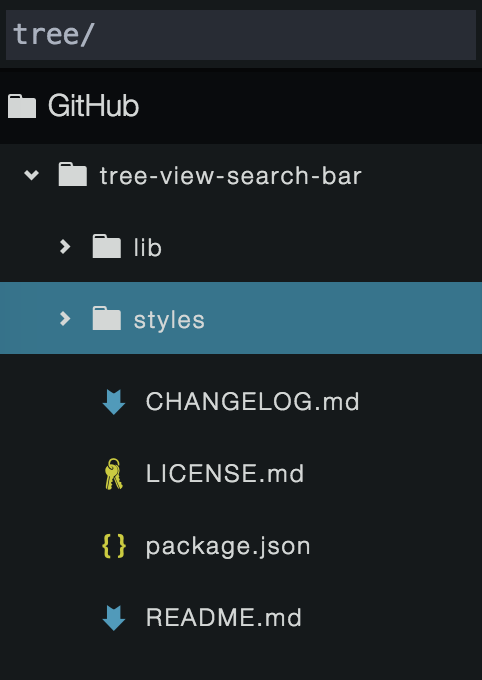
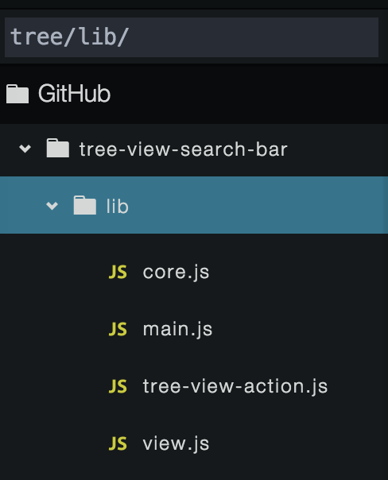
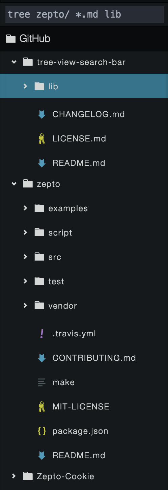

# tree-view-search-bar
> I can reavel which files you are looking for by your keywords in tree view.

# 使用方法
> Usage

* `apm install tree-view-search-bar`
* command: `search-bar:toggle`
* enjoy it ☺️

### 字符 : String

* 匹配包含该字符串的文件夹与文件
* 大小写不敏感

### 文件 : File

* 使用`.`来识别文件类型
* 允许使用正则
* 使用`*`来代表任何长度的文件名
* 使用`*`来代表任何长度的文件类型

### 路径 : Path

* 使用`/`或者`\`来识别路径类型
* 每一段路径使用字符的匹配规则匹配
* 当以`/`或者`\`结尾时, 默认显示该文件夹下全部文件与文件夹

### 组合 : Combo

* 使用`空格`分割每一条表达式
* 只要符合其中一条表达式的匹配规则则会显示

# TODO

* 大小写敏感(Case Sensitivity)
* 匹配正则表达式(Regular Expression)
* 关键字补全(Autocomplete)
* 模糊搜索(Fuzzy)
* 匹配高亮(Highlight)
* 深度匹配(Match file in fold directory)
